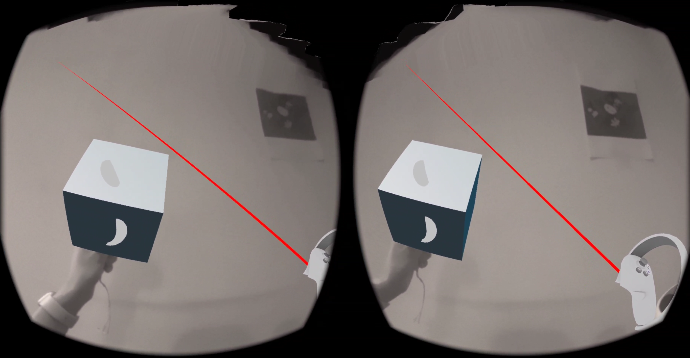

# 透视

透视（Pass Through）的实现方式是通过XR设备的摄像头捕捉现实世界的场景，再将其传输到显示器上，让用户可以看到现实世界的场景。在虚拟现实环境中，用户无法感知现实世界的环境，容易发生碰撞或者其他安全问题，使用Pass-Through技术可以让用户感知现实世界的环境，不但可以更加安全地在虚拟现实环境中行动，还可以增强虚拟现实的沉浸感。

## 透视功能

XR扩展提供了专门用于渲染透视图像的层，同时使用合成层技术控制透视图像与虚拟场景的融合显示关系。

| 属性      | 说明                                                  |
| --------- | ----------------------------------------------------- |
| Placement | 指定Pass Through Layer的合成方式。                    |
| Depth     | 设置深度来指定Pass Through在Composition Layer的排序。 |
| Opacity   | 设置Pass Through图像的不透明度。                      |

注：透视功能对接OpenXR的非核心扩展API。当前版本只对接了Meta Quest系列设备。

## 开启透视

调整 **XR HMD** 节点Camera组件的Clear Flags为SOLID_COLOR，Clear Color的不透明度调为0。

为XR HMD节点添加透视组件，找到 **XR > Extra > XRPassThroughLayer**，点击添加。

要想将透视视频图像显示在所有3D内容之下，**Placement** 属性请选择为 **Underlay**。

打包即可看到透视效果。

注：使用透视功能需要扩展版本 **>=1.2.0**，编辑器版本 **>=3.7.3**。