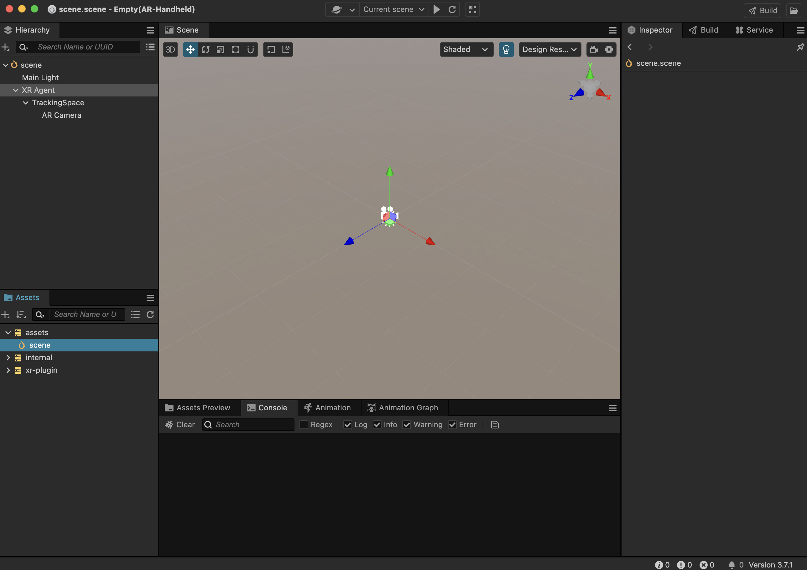
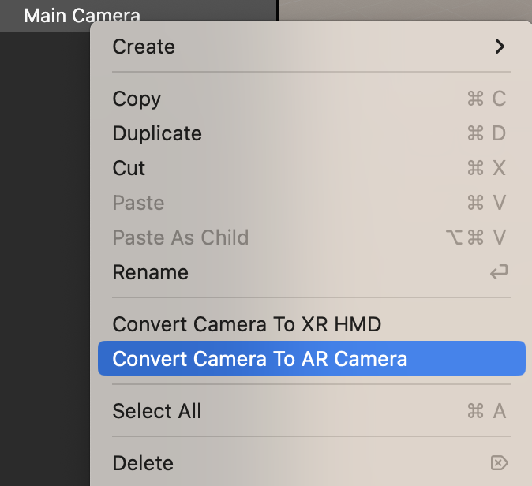

# AR项目创建

参照以下步骤完成对项目的AR相关特性配置。

以下提供三种方法，可以任选一种来配置扩展或直接打开内置AR项目。

### 方法一：将xr-plugin应用到项目

在cocos store中搜索xr-plugin，获取扩展并安装，具体安装说明请参考[说明](../../editor/extension/install)。

安装完毕后将扩展添加至对应工程。

这种方式适合为存量3D项目做XR模式迁移。

### 方法二：创建AR模板工程

Dashboard中新建项目，编辑器版本选择3.7.1或更高，模板类别下选择Empty(AR Mobile)进行创建。

打开项目，进入scene场景。场景已经包含初始的AR Camera配置，可以直接进行功能开发。

创建AR案例

Dashboard中新建项目，编辑器版本选择3.7.1或更高，案例类别下选择AR(移动端)案例进行创建。

案例项目中包含当前版本扩展完整的有关AR特性功能的内容，可以直接进行构建打包体验。AR应用的构建发布相关说明请查阅[构建与发布](ar-proj-pub.md)。

### 方法三：场景配置

若采用第一种将xr-plugin应用到项目的方式配置插件，还需进行以下步骤对普通的3D场景完成AR功能的基本配置。

应用中的每个AR场景中必须要包含两个关键对象：XR Agent和AR Camera。

推荐以下两种方式任选一种来进行场景配置：

1. 右键单击“层次管理器”窗口，选择创建XR > XR Agent。选中XR Agent节点，右键创建Empty Node，并重命名为TrackingSpace。选中TrackingSpace节点，右键创建XR > AR Camera。

   

   选中XR Agent节点，在属性检查器中点击“添加组件”，添加 XR > AR Tracking > ARSession 和 XR > AR Tracking > ARManager。

   

2. 对于空场景或现有项目，可以直接选中场景中主摄像机，右键选择转为 AR Camera，即可得到上述默认的结构。

   

XR Agent和AR Camera及其组件在AR项目中扮演着重要的角色。要更详细地了解它们，请分别查阅[设备映射]( ../architecture/component.md#设备映射组件)和[AR相机](../architecture/ar-camera.md)。

## Spaces平台项目场景设置

新建空场景，将场景中Main Camera右键选择转为 XR HMD。

选中XR Agent，点击Add Component添加ARSession和ARManager组件。

可以参考[平面追踪](../architecture/ar-tracking-component.md#平面追踪)和[图像追踪](../architecture/ar-tracking-component.md#图像追踪)给应用做AR赋能。

功能开发完成后可直接打包发布。

在Dashboard的VR案例中，提供了一个简易的Spaces专用场景，可以直接打包应用并将此场景设为启动场景。

具体有关高通 Spaces平台的AR SDK请参考[这里](https://docs.spaces.qualcomm.com/)。