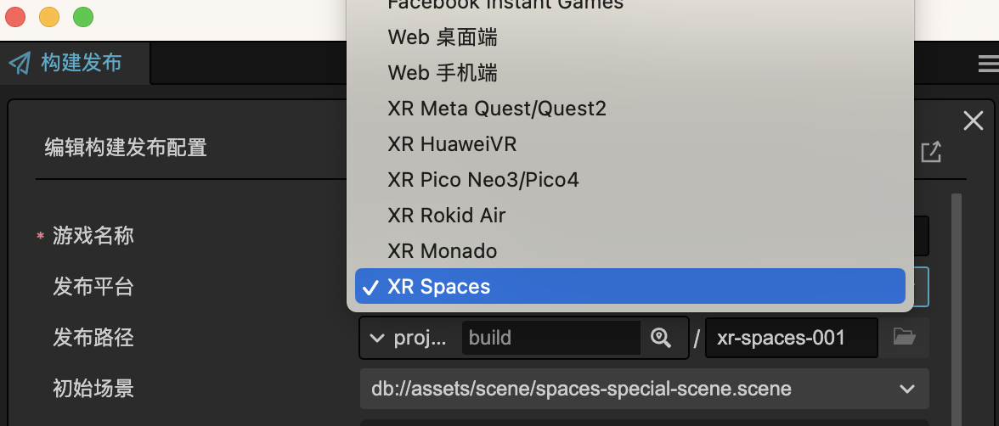

# AR项目构建与发布

完成AR应用的项目设置并完成项目开发之后，即可打包AR应用。点击**菜单栏 > 项目 > 构建发布**。

## ARCore、AREngine

针对于安卓和华为平台的手机发布AR应用，新建构建任务，平台选择**安卓**。

填写应用ID并勾选**Enable AR**，连接好移动端设备后点击构建>生成>运行即可一键发布AR应用。

**注：安卓平台AR应用的渲染后端不支持VULKAN**。

## ARKit

iOS发布需要的各项配置属性请参考[iOS 平台构建选项](../../editor/publish/native-options.md#iOS 平台构建选项)，需要在Xcode中配置好开发者账户。

针对于iOS平台发布AR应用，新建构建任务，平台选择**iOS**。

应用ID名称第二节建议使用Xcode配置的同名开发者账户名，目标平台选择**iPhone OS应用**，勾选**Enable AR**。

点击构建，生成Xcode工程。

**注：目前Cocos引擎对iOS应用暂时只支持构建工程，编译和运行需要转移至Xcode中进行。**

构建完成后，找到生成的xcodeproj文件，使用Xcode打开，配置好签名和开发者团队连接好设备点击运行即可。

## Spaces

针对于高通Spaces平台的设备发布AR应用，新建构建任务，平台选择**XR Spaces**。

填写好应用ID，连接好Spaces设备（如果是分体式设备请连接移动端）后点击**构建>生成>运行**即可一键发布AR应用。